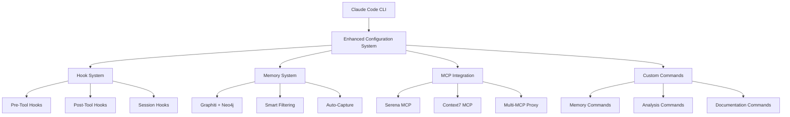

# Claude Code Enhanced Configuration
### Professional Development Environment with Advanced Automation

[](./COMPLETE_SETUP_GUIDE.md)
[](./LICENSE)
[](./COMPLETE_SETUP_GUIDE.md)

Transform your Claude Code into a **proactive development partner** with automatic quality assurance, persistent memory, intelligent workflow orchestration, and mobile notifications.

## 🚀 Quick Start

### For First-Time Users
```bash
# 1. Clone this repository to your ~/.claude directory
git clone <this-repo> ~/.claude
cd ~/.claude

# 2. Set your OpenAI API key
export OPENAI_API_KEY="your-key-here"

# 3. Run the complete setup
./COMPLETE_SETUP_GUIDE.md  # Follow the guide step by step
```

### For Experienced Users
```bash
# Quick setup for those who know what they're doing
export OPENAI_API_KEY="your-key"
./initialize-graphiti.sh      # Neo4j + Memory system
./multi-mcp-setup.sh         # MCP proxy setup
claude code                  # Test the system
```

## ⚡ What This System Provides

### 🤖 Automatic Workflow Intelligence
- **Prevents common mistakes** through intelligent pre-flight checks
- **Routes tools optimally** (Serena for code analysis, Context7 for documentation)
- **Builds institutional knowledge** across all coding sessions
- **Enforces development best practices** automatically

### 📱 Mobile Integration (Optional)
- Real-time Signal notifications for session starts
- Permission requests for sensitive operations
- Project-aware mobile alerts

### 🧠 Persistent Memory System
- **Graphiti knowledge graph** with Neo4j backend
- **Cross-session memory** - remembers all your work
- **Intelligent search** - find past solutions instantly
- **Automatic capture** - no manual memory management needed

### 🛠️ Enhanced Tool Integration
- **Serena MCP**: Semantic code analysis and manipulation
- **Context7**: Curated documentation management
- **Gemini CLI**: Large-context codebase analysis
- **Multi-MCP Proxy**: Unified MCP server management

### ⚡ Custom Slash Commands (13 Total)
```bash
/remember [text]        # Save important context
/recall [query]         # Search memory database
/compact               # Compress conversation + auto-save

# Gemini Analysis Commands
/gemini-overview       # Project architecture overview
/gemini-analyze        # Comprehensive codebase analysis
/gemini-security       # Security audit scan
/gemini-performance    # Performance bottleneck analysis
/gemini-review         # AI-powered code review

# Documentation Commands  
/context7-docs         # Search curated documentation
```

## 📊 System Architecture



## 🗂️ Repository Structure

```
~/.claude/
├── 📄 Core Configuration
│   ├── CLAUDE.md                    # Behavior instructions
│   ├── settings.json                # MCP and tool configuration
│   ├── memory-config.json          # Memory system settings
│   └── hooks.json                  # Workflow automation rules
│
├── 📚 Documentation
│   ├── README.md                   # Overview (this file)
│   ├── COMPLETE_SETUP_GUIDE.md     # Full installation guide
│   ├── QUICK_REFERENCE.md          # Command reference
│   ├── PEER_SHARING_AUDIT_REPORT.md # System analysis
│   └── docs/                       # Additional guides
│
├── 🔧 Automation Scripts
│   ├── hooks/                      # Hook implementations
│   ├── *.sh                       # Shell automation scripts
│   └── *.py                       # Python components
│
├── ⚡ Custom Features
│   ├── slash-commands/             # Custom command definitions
│   ├── commands/                   # Command implementations
│   └── agents/                     # Specialized agents
│
└── 🧠 Memory & State
    ├── mcp-configs/               # MCP server configurations
    ├── config/                    # Local configuration
    └── local/                     # User-specific data (gitignored)
```

## 🎯 Key Features Deep Dive

### Intelligent Hook System
The system includes comprehensive hooks that automatically:

1. **Pre-Tool Analysis**: Prevents wrong tool usage (e.g., blocks Grep when Serena should be used)
2. **Impact Analysis**: Shows what depends on files before editing
3. **Duplicate Detection**: Finds similar code before writing new functions
4. **Quality Assurance**: Reviews code changes for consistency and security
5. **Memory Capture**: Automatically saves significant work to knowledge graph

### Memory System (Graphiti + Neo4j)
- **Automatic Chunking**: Long content split intelligently for better storage
- **Smart Filtering**: Ignores trivial operations, focuses on meaningful work
- **Batch Processing**: Groups related operations for efficiency
- **Cross-Project Intelligence**: Builds knowledge across multiple projects

### Multi-MCP Integration
- **Unified Proxy**: Single endpoint managing 9+ MCP servers
- **Intelligent Routing**: Automatic selection of best tool for each task
- **Zero Configuration**: Works out of the box after setup
- **Scalable Architecture**: Easy to add new MCP servers

## 🧪 Testing Your Setup

### Basic Functionality Test
```bash
claude code
/remember This is a test memory
/recall test
# Should return your saved memory
```

### Advanced Features Test
```bash
claude code
/gemini-overview                    # Should analyze project structure
/context7-docs "react hooks"       # Should search documentation
```

### Integration Test
```bash
claude code
"Create a simple function"          # Should trigger pre-write duplicate check
"Edit the function"                 # Should trigger impact analysis
```

## 📋 Prerequisites

### Required Dependencies
- **Claude Code CLI** (latest version)
- **Docker** (for Neo4j memory system)
- **Git** (for repository management)
- **Python 3.8+** (for automation scripts)
- **Node.js** (if using JavaScript projects)

### Optional Dependencies
- **Signal CLI** (for mobile notifications)
- **Gemini CLI** (for enhanced code analysis)
- **Go** (for certain MCP servers)

### Environment Variables
```bash
export OPENAI_API_KEY="your-openai-key"

# Optional: Signal Integration
export SIGNAL_SENDER="your-signal-number"
export SIGNAL_RECIPIENT="your-phone-number"

# Optional: Enhanced Analysis
export GEMINI_API_KEY="your-gemini-key"
```

## 🚨 Important Security Notes

### What's Safe to Share
- ✅ All configuration files (API keys use environment variables)
- ✅ Hook scripts and automation logic
- ✅ Documentation and setup guides
- ✅ Slash command definitions

### What's NOT Included (Gitignored)
- ❌ Log files and debug output
- ❌ Personal memory databases
- ❌ User-specific configuration
- ❌ Process IDs and temporary files
- ❌ API keys (environment variables only)

## 🛠️ Customization Guide

### Adding New Hooks
1. Create hook script in `hooks/`
2. Add hook configuration to `hooks.json`
3. Test with `claude code --debug`

### Custom Slash Commands
1. Add command definition to `slash-commands/`
2. Implement command logic in `commands/`
3. Update `settings.json` if needed

### Memory System Tuning
1. Edit `memory-config.json` for filtering rules
2. Adjust batching parameters for performance
3. Configure importance scoring

## 📈 Performance Optimization

The system is optimized for:
- **Low Latency**: Smart filtering reduces memory overhead by 95%
- **High Relevance**: Intelligent importance scoring focuses on meaningful work
- **Scalability**: Batch processing handles high-volume development sessions
- **Efficiency**: Parallel hook execution doesn't block user workflow

## 🔧 Troubleshooting

### Common Issues

#### "Neo4j not running"
```bash
docker ps | grep neo4j
./initialize-graphiti.sh
```

#### "MCP servers not connecting"
```bash
curl http://localhost:8080/mcp_servers
./multi-mcp-setup.sh
```

#### "Hooks not firing"
```bash
cat ~/.claude/hooks.json | jq .
chmod +x ~/.claude/*.sh
```

#### "Memory not saving"
```bash
tail -f ~/.claude/graphiti-hook.log
```

### Debug Mode
```bash
claude code --debug
# Enables verbose logging for troubleshooting
```

## 🤝 Contributing

### For Issues
1. Check existing documentation first
2. Enable debug mode for detailed logs
3. Create issue with system information

### For Enhancements
1. Fork the repository
2. Test changes thoroughly
3. Update documentation
4. Submit pull request

### Development Guidelines
- Follow existing code style
- Add tests for new hooks
- Update documentation
- Respect security principles (no hardcoded secrets)

## 📜 License

MIT License - See [LICENSE](./LICENSE) for details.

## 🎯 What's Next?

This system transforms Claude Code from a reactive assistant into a proactive development partner. After setup, it will:

1. **Learn your patterns** and suggest improvements
2. **Prevent common mistakes** before they happen  
3. **Build institutional knowledge** across all projects
4. **Provide mobile awareness** of your development workflow
5. **Scale with your team** through shared configuration

**Ready to get started?** → [COMPLETE_SETUP_GUIDE.md](./COMPLETE_SETUP_GUIDE.md)

---

*This enhanced system represents months of development workflow optimization. Star this repository if it improves your Claude Code experience! 🌟*